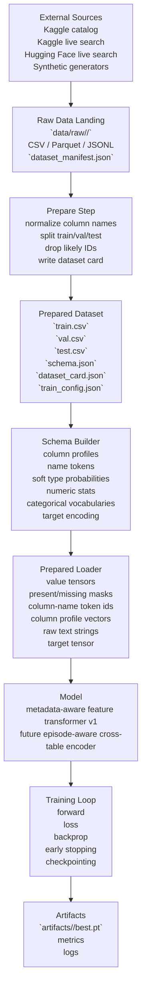
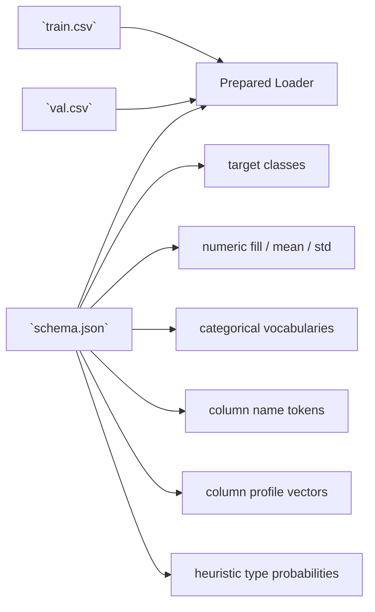
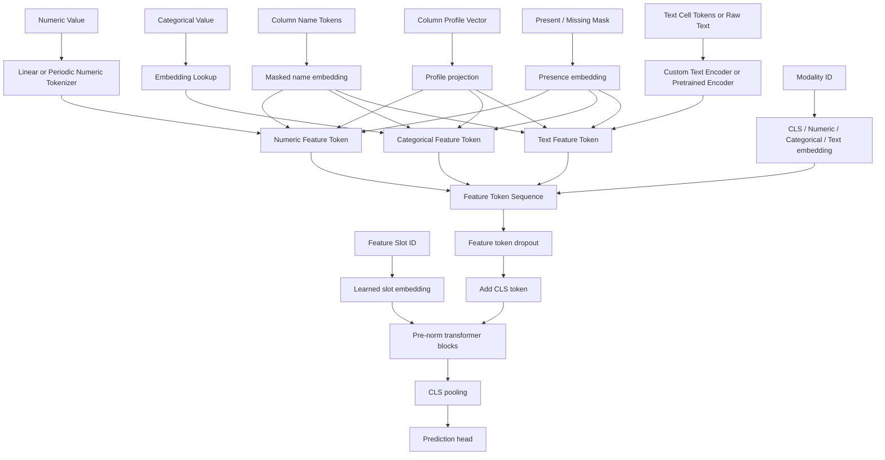
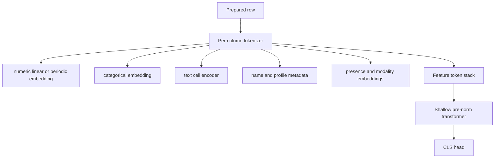
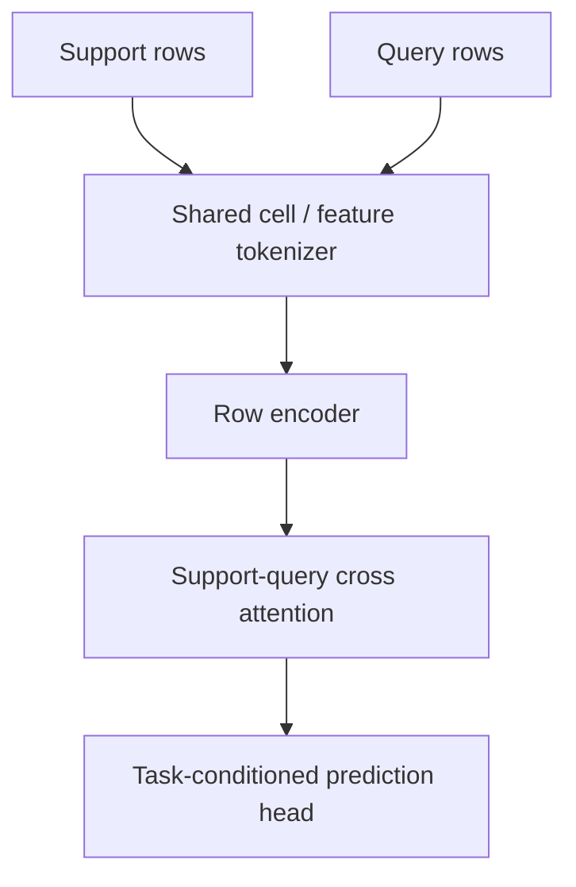
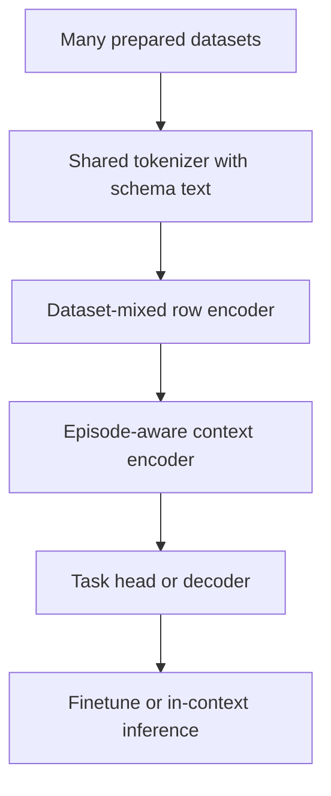

# Architecture

This page describes the current `tabula` pipeline and the updated model direction after reviewing modern transformer design, tabular transformers, and recent tabular foundation-model work.

## End-to-End Pipeline



## Prepared Data Contract



## Current Batch Structure

The loader emits one batch object with both values and column metadata.

```text
TabularBatch
  x_num: [batch, num_numeric_features]
  x_cat: [batch, num_categorical_features]
  x_text_token_ids: [batch, num_text_features, text_token_count]
  x_num_mask: [batch, num_numeric_features]
  x_cat_mask: [batch, num_categorical_features]
  x_text_mask: [batch, num_text_features]
  num_name_token_ids: [num_numeric_features, name_token_count]
  cat_name_token_ids: [num_categorical_features, name_token_count]
  text_name_token_ids: [num_text_features, name_token_count]
  num_profile_vectors: [num_numeric_features, profile_dim]
  cat_profile_vectors: [num_categorical_features, profile_dim]
  text_profile_vectors: [num_text_features, profile_dim]
  y: [batch]
```

## Current In-Repo Model

The current implementation remains a flat feature-token transformer, but it is now closer to modern transformer best practice and gives us a cleaner bridge to cross-table pretraining later.



### Feature Token Composition

```text
feature_token =
  value_embedding
+ column_name_embedding
+ column_profile_embedding
+ present_missing_embedding
+ modality_embedding
+ learned_feature_slot_embedding
```

### Transformer Block Defaults

The in-repo default is now:

- pre-norm residual blocks
- `RMSNorm` by default, with `LayerNorm` still available
- `SwiGLU` feed-forward by default, with `GELU` still available
- feature-token dropout to reduce schema overfitting
- optional periodic numeric embeddings for continuous columns

These changes track mature transformer practice from [RMSNorm](https://arxiv.org/abs/1910.07467), [GLU Variants Improve Transformer](https://arxiv.org/abs/2002.05202), and the broader move toward pre-norm gated blocks in modern language models. We are not adding RoPE to the row encoder because column tokens are schema slots rather than natural sequence positions.

## Research Summary And Architectural Implications

### 1. Strong tokenization matters more than a deeper vanilla backbone

[FT-Transformer / Revisiting Deep Learning Models for Tabular Data](https://arxiv.org/abs/2106.11959) and [On Embeddings for Numerical Features in Tabular Deep Learning](https://arxiv.org/abs/2203.05556) both point in the same direction: the way we convert heterogeneous columns into tokens is usually more important than simply stacking more attention layers.

Implication for `tabula`:

- keep the feature-token view
- invest in numeric embeddings, metadata use, and missingness handling
- prefer modest depth with better tokenization over deep generic transformers

### 2. Cross-row and self-supervised training help, but only when the batching regime supports them

[SAINT](https://openreview.net/forum?id=nL2lDlsrZU) showed that row attention and contrastive pretraining can improve tabular representations. This matters more once the dataloader and objective explicitly expose support/query structure or augmentations.

Implication for `tabula`:

- the existing `EpisodeBatch` path is strategically correct
- a future row-context encoder should be trained with episodic or support/query batches rather than plain IID rows only
- supervised-only single-row training is a useful baseline, not the end state

### 3. Transfer across tables needs column semantics, not just shared weights

[TransTab](https://arxiv.org/abs/2205.09328), [XTab](https://arxiv.org/abs/2405.06090), and [Large Scale Transfer Learning for Tabular Data](https://arxiv.org/abs/2406.19308) all reinforce that cross-table generalization depends on semantic column identity, schema text, and pretraining across many datasets.

Implication for `tabula`:

- keep column names as first-class inputs
- preserve raw text values for stronger text backends
- move toward cross-table pretraining objectives instead of dataset-isolated finetuning only

### 4. The frontier in tabular modeling is not "bigger transformer only"

[TabM](https://arxiv.org/abs/2410.24210) is a strong reminder that parameter-efficient ensembling and carefully regularized MLP-style models remain extremely competitive. [Why do tree-based models still outperform deep learning on tabular data?](https://arxiv.org/abs/2207.08815) also remains relevant: tabular learning punishes unnecessary complexity and rewards inductive bias.

Implication for `tabula`:

- always keep strong non-transformer baselines in the loop
- hybrid heads and residual ensembling are more promising than blindly deepening attention
- architecture decisions should be benchmarked against GBDTs and simple neural baselines, not only against older transformers

### 5. Foundation-model style tabular systems are real, but they change the training problem

[TabPFN](https://arxiv.org/abs/2207.01848), [Accurate predictions on small data with a tabular foundation model](https://www.nature.com/articles/s41586-024-08328-6), and the large-transfer work above all suggest that the long-term win condition is closer to in-context or foundation-style prediction than classic per-dataset training.

Implication for `tabula`:

- the architecture should evolve toward support/query conditioning
- synthetic and multi-dataset pretraining are core, not optional extras
- the model should remain schema-aware and able to consume variable column sets cleanly

## Revised Architecture Strategy

### Phase 1: Better Flat Feature Transformer

This is the model we can train now with the current codebase.



Recommended defaults:

- shallow-to-medium depth, wider hidden size
- `RMSNorm` + `SwiGLU`
- metadata-aware tokens
- feature-token dropout
- periodic numeric embeddings as an ablation worth running early

### Phase 2: Episode-Aware Row Context

This is the next substantive step after the current baseline stabilizes.



Why this matters:

- aligns the architecture with PFN-style and in-context tabular learning
- creates a natural home for SAINT-like row attention
- lets the model use neighboring rows as computation rather than only as SGD samples

### Phase 3: Cross-Table Foundation Model

This is the target architecture for large-scale transfer.



Required ingredients:

- multi-dataset training mixtures
- schema text and metadata retention
- synthetic tasks and masked-cell objectives
- support/query training, not just single-row supervision

## High-Upside, Underresearched Features

These are not default architecture commitments yet, but they are plausible performance levers for `tabula`.

### Schema-relation attention bias

Use column-name similarity, profile similarity, or co-occurrence statistics to build a learned attention bias or graph over columns. This is motivated by graph-aware tabular work such as [T2G-Former](https://arxiv.org/abs/2301.08643) and hypergraph-style relational modeling like [HyTrel](https://arxiv.org/abs/2407.16697).

Why it is interesting:

- our current model already has column metadata
- tabular columns are not arbitrary tokens; some pairs should interact more strongly than others
- it could improve transfer across schemas without forcing a fixed column order

### Retrieval-conditioned support rows

Retrieve similar rows, tables, or schema fragments and feed them as support context before prediction.

Why it is interesting:

- combines tabular foundation-model ideas with pragmatic nearest-neighbor structure
- likely especially strong for small-data and long-tail schemas
- still underexplored compared with generic row-only attention

### Feature slot randomization and schema dropout

Randomize feature order during training where safe, and drop subsets of columns or metadata channels intentionally.

Why it is interesting:

- should reduce overfitting to accidental schema order
- may force the model to depend more on semantic metadata than on slot identity
- easy to combine with the current tokenizer and feature-token dropout

### Transformer trunk with TabM-style residual ensemble head

Keep the transformer as a shared feature extractor, but route the final prediction through a lightweight ensemble or mixture head inspired by [TabM](https://arxiv.org/abs/2410.24210).

Why it is interesting:

- ensembling remains one of the most reliable sources of tabular gains
- cheaper than fully ensembling whole transformers
- a strong hedge against the transformer trunk learning overly smooth decision surfaces

### Adaptive numeric basis banks

Go beyond fixed linear or periodic numeric tokenization by learning per-feature mixtures of basis families.

Why it is interesting:

- numeric columns differ sharply in scale, monotonicity, and local smoothness
- current tabular DL literature still has more room here than in generic attention design
- this could become a signature advantage for heterogeneous real-world tables

## Training Best Practice For This Repo

- Track strong baselines alongside the transformer. A transformer-only benchmark story is not credible for tabular data.
- Prefer better tokenization, metadata, and regularization before increasing depth.
- Use the current flat model for supervised baselines, then move to episodic support/query training once the batch path is stable.
- Keep raw text values and column names in the prepared contract; they are needed for transfer and schema-aware pretraining.
- Use optimized attention kernels when sequence length or text-heavy batches justify it. [FlashAttention](https://arxiv.org/abs/2205.14135) matters more for longer token sequences than for small pure-tabular rows.
- Treat cross-table pretraining as a data and objective problem first, not just an architecture problem.

## Practical Roadmap

1. Stabilize the current upgraded flat transformer and ablate:
   - `layernorm` vs `rmsnorm`
   - `gelu` vs `swiglu`
   - linear vs periodic numeric embeddings
   - feature-token dropout on/off
2. Add stronger baselines:
   - GBDT
   - regularized MLP / ResNet-style tabular model
   - TabM-style head if we want a neural non-transformer champion
3. Promote `EpisodeBatch` from helper to first-class training mode.
4. Add cross-table objectives:
   - masked-cell reconstruction
   - contrastive row or schema views
   - support/query prediction
5. Prototype one exploratory feature:
   - schema-relation attention bias
   - retrieval-conditioned support context
   - transformer plus ensemble head

## Design Notes

- Column names remain first-class inputs because cross-table transfer depends on semantic schema identity.
- Hard dtype inference is still avoided; the schema should keep soft type evidence.
- Prepared datasets remain the canonical training input format.
- The current flat model is not the destination. It is a deliberately strong tokenizer-plus-transformer baseline that keeps the future foundation-model path open.
